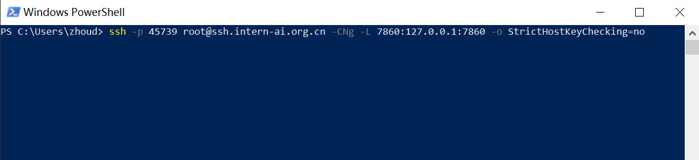
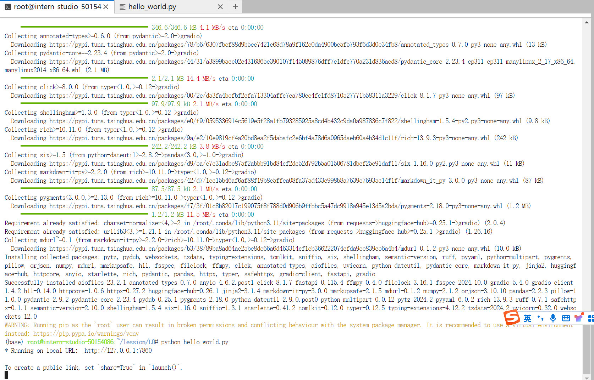
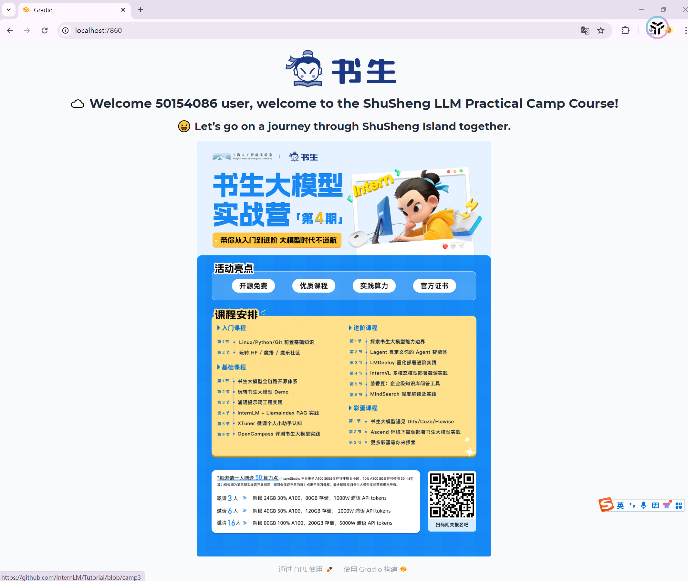
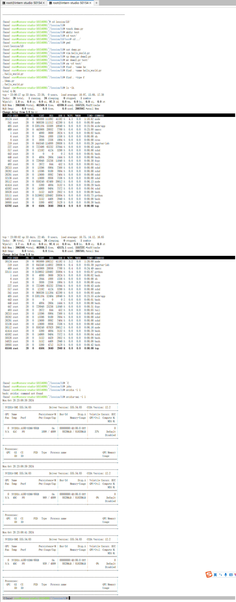
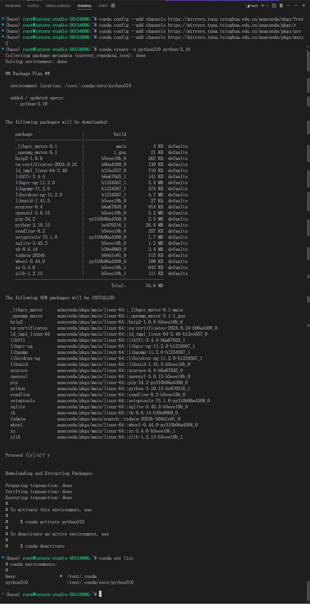
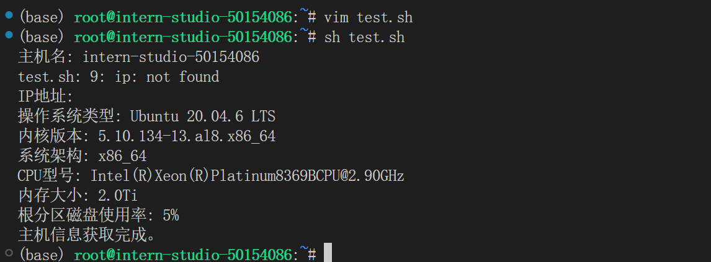

# 闯关任务
> 完成SSH连接与端口映射并运行hello_world.py

ssh连接开发机并端口映射

启动`hello_world.py`服务

本地端访问`hello_world.py`服务

# 任务1
> 将Linux基础命令在开发机上完成一遍

# 任务2
> 使用 VSCODE 远程连接开发机并创建一个conda环境

# 任务3
> 创建并运行test.sh文件

