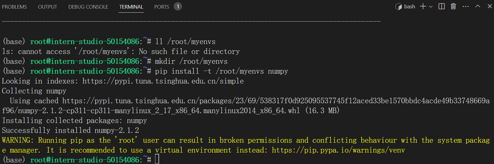

# 任务1

> Leetcode 383(笔记中提交代码与leetcode提交通过截图)	


代码
```python
class Solution:
    def canConstruct(self, ransomNote: str, magazine: str) -> bool:
        ransomNote=ransomNote.lower()
        magazine=magazine.lower()

        if ransomNote in magazine:
            return True
        else:
            return False

```

通过截图


# 任务3
> 使用VScode连接开发机后使用pip install -t命令安装一个numpy到看开发机/root/myenvs目录下，并成功在一个新建的python文件中引用。

安装截图


运行代码截图
