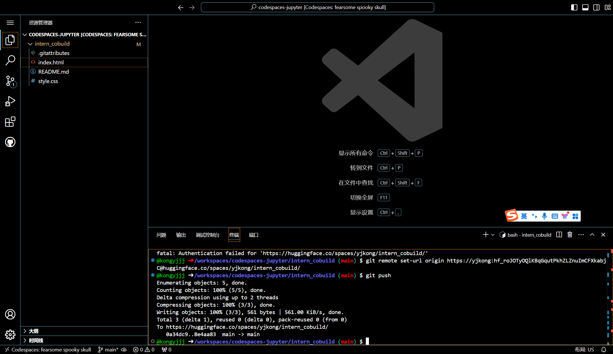

# L0G4000 任务

## 任务1
> 使用Hugging Face平台、魔搭社区平台（可选）和魔乐社区平台（可选）下载文档中提到的模型（至少需要下载config.json文件、model.safetensors.index.json文件），请在必要的步骤以及结果当中截图。

## 任务2
> 将我们下载好的config.json文件（也自行添加其他模型相关文件）上传到对应HF平台和魔搭社区平台，并截图。	

> 
## 任务3
> 在HF平台上使用Spaces并把intern_cobuild部署成功，关键步骤截图。

