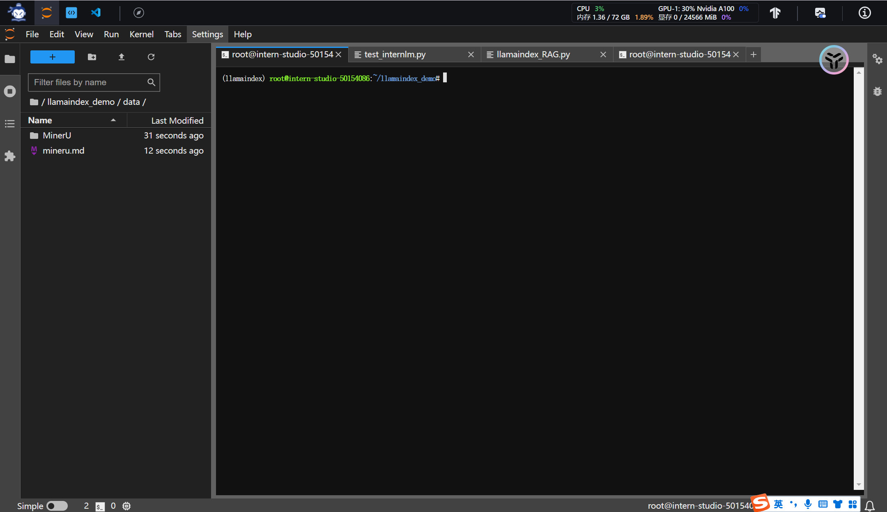
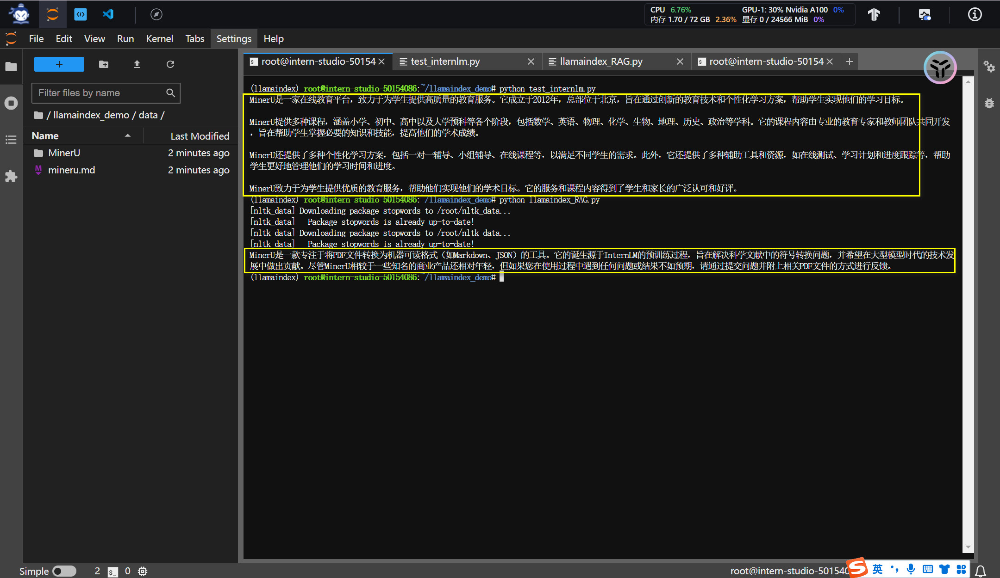
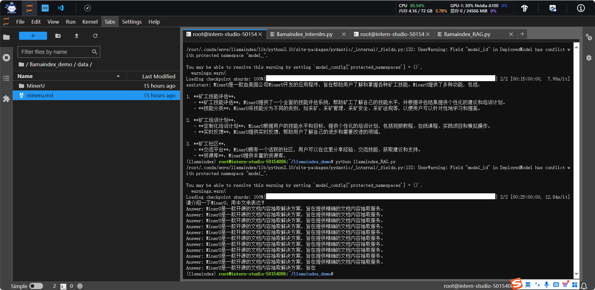

# 任务1
> 基于 LlamaIndex 构建自己的 RAG 知识库，寻找一个问题 A 在使用 LlamaIndex 之前 浦语 API 不会回答，借助 LlamaIndex 后 浦语 API 具备回答 A 的能力，截图保存。注意：写博客提交作业时切记不要泄漏自己 api_key！

知识库为MinerU

RAG前后的回答

# 任务2
> 基于 LlamaIndex 构建自己的 RAG 知识库，寻找一个问题 A 在使用 LlamaIndex 之前 InternLM2-Chat-1.8B 模型不会回答，借助 LlamaIndex 后 InternLM2-Chat-1.8B 模型具备回答 A 的能力，截图保存。

